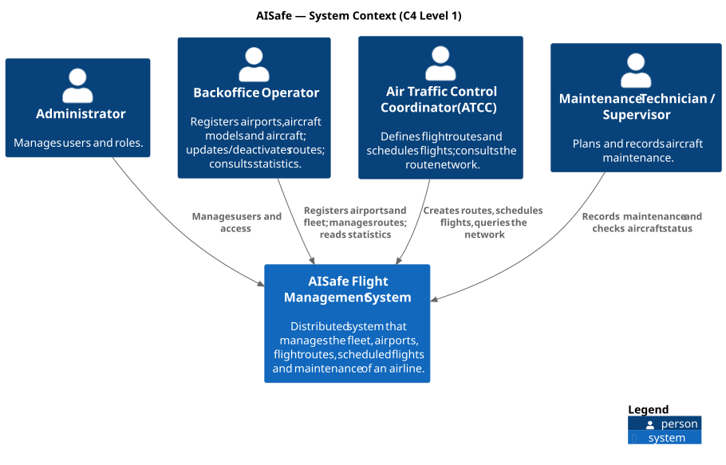

# C4 Level 1 — System Context

> *"How does this system fit into the world?"* — the big picture, for every audience. Only people and software systems; no technology.

## The system

**AISafe Flight Management System** supports the daily operation of an airline: its fleet, the airports it operates in, the routes it flies, the flights it schedules and the maintenance of its aircraft.

It was originally a monolith (PSOFT). In SIDIS it is redesigned as a distributed system that keeps working when parts of it fail; how it is split is shown in [Level 2](../2-containers/Containers.md).

## People (users)

| Person | What they do with AISafe |
|---|---|
| **Administrator** | Manages users and their roles. |
| **Backoffice Operator** | Registers airports, aircraft models and aircraft; updates and deactivates routes; consults statistics such as the busiest airports. |
| **Air Traffic Control Coordinator (ATCC)** | Defines flight routes, assigns aircraft to routes at a date/time, and queries the route network (popular routes, network distance, alternative itineraries). |
| **Maintenance Technician / Supervisor** | Plans and records maintenance of the aircraft and checks which routes an aircraft can fly. |

Every person authenticates and is given a **role**; each role can only use the functions meant for it.

## External systems

AISafe does not depend on external software systems in this assignment. Users are identified with tokens issued for the AISafe roles (in development, by a test endpoint; a real identity provider is future work).

## Main relationships

| From | To | Purpose |
|---|---|---|
| Administrator | AISafe | Manage users and access |
| Backoffice Operator | AISafe | Register airports and fleet, manage routes, read statistics |
| ATCC | AISafe | Create routes, schedule flights, query the network |
| Maintenance Technician / Supervisor | AISafe | Record maintenance, check aircraft status |

## Quality goals (from the assignment)

| Goal | Meaning for AISafe |
|---|---|
| **Availability and fault tolerance** | The system keeps answering when a server or part of the network fails. |
| **Scalability** | More servers can be added to share the load. |
| **Security** | Fleet, route and maintenance data is operationally sensitive: only authorised people see it, it travels encrypted, and every access is recorded. |
