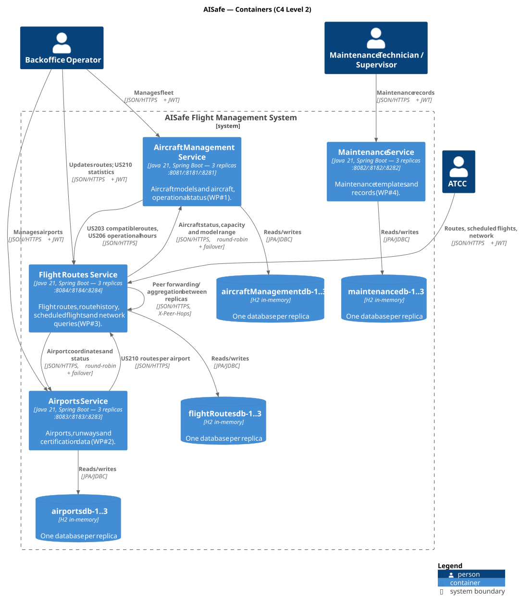
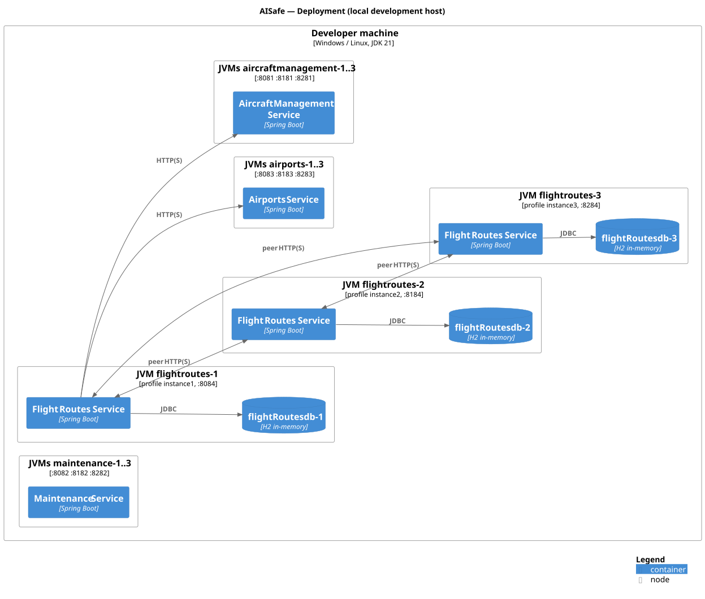

# C4 Level 2 — Containers

> The separately deployable units that make up AISafe, the technology of each one and how they communicate. Zoom of the single box of [Level 1](../1-context/Context.md).



## 1. Containers

The monolith was decomposed by **bounded context** (domain-driven segregation). Each service is a separate Spring Boot application, runs as **three replicas**, and each replica owns **its own database**. Data of another service is only reachable through that service's REST API.

| Container | Technology | Replicas (port) | Data | Responsibility (bounded context) | Details |
|---|---|---|---|---|---|
| **Aircraft Management Service** | Java 21, Spring Boot 4 | 8081 / 8181 / 8281 | H2 `aircraftManagementdb-N` | *Fleet*: aircraft models, aircraft, operational status (WP#1) | [L3](../3-components/aircraftmanagement/AircraftManagement-Components.md) |
| **Maintenance Service** | Java 21, Spring Boot 4 | 8082 / 8182 / 8282 | H2 `maintenancedb-N` | *Maintenance*: templates and records (WP#4) | [L3](../3-components/maintenance/Maintenance-Components.md) |
| **Airports Service** | Java 21, Spring Boot 4 | 8083 / 8183 / 8283 | H2 `airportsdb-N` | *Airport infrastructure*: airports, runways, certification (WP#2) | [L3](../3-components/airports/Airports-Components.md) |
| **Flight Routes Service** | Java 21, Spring Boot 4 | 8084 / 8184 / 8284 | H2 `flightRoutesdb-N` | *Flight operations*: routes, history, scheduled flights, network queries (WP#3) | [L3](../3-components/flightroutes/FlightRoutes-Components.md) |
| *common* (library, not a container) | Java library | embedded in every service | — | Security, peer forwarding, resilience, audit — the same distributed behaviour in every container | [L3](../3-components/common/Common-Components.md) |

Ports, database names and per-replica configuration: [Ports.md](Ports.md).

## 2. Communication between containers

All communication is **synchronous HTTP/REST with JSON** (commands and queries; the assignment does not allow events/message queues).

| From | To | Endpoints | Purpose |
|---|---|---|---|
| Users | every service | REST API (Swagger at `/swagger-ui.html`) | Use cases, with `Authorization: Bearer <JWT>` |
| Flight Routes | Airports | `GET /airports/{iata}` | Coordinates (route distance) and operational status (US110, US209, US212, US216) |
| Flight Routes | Aircraft Management | `GET /api/aircrafts/{reg}`, `GET /api/aircraft-models/{model}` | Status, seating capacity and range (US212, US213) |
| Aircraft Management | Flight Routes | `GET /api/routes/compatible`, `GET /api/scheduled-flights/operational-hours` | US203, US206 |
| Airports | Flight Routes | `GET /api/routes/statistics/count-by-airport` | US210 |
| Replica | other replicas of the **same** service | the same endpoint that was called, with `X-Peer-Hops: 1` | Peer forwarding / aggregation (section 3.2) |

*(Rows for Maintenance and the other services are added by their owners.)*

**Context mapping (DDD):** a caller is a *customer* of the called service (*supplier*); each caller translates the remote DTOs into its own model in an **anti-corruption layer** (`clients` package). Aggregates of other services are referenced only **by identity** (IATA code, registration number). The `common` library is a technical *shared kernel* without domain classes.

**HTTP headers used between containers**

| Header | Direction | Meaning |
|---|---|---|
| `Authorization: Bearer <JWT>` | request | End user; forwarded unchanged to peers and remote services |
| `X-Correlation-Id` | request/response | Request id, propagated to every replica/service and written in every log line |
| `X-Peer-Hops` | request | Present only in replica-to-replica calls; the receiver answers with local data only |
| `X-Service-Key` | request | Shared secret that authenticates the calling service |
| `X-Caller-Instance` | request | Calling replica/service (audit) |
| `X-Partial-Response`, `X-Unavailable-Peers` | response | A replica did not answer; the result may be incomplete |

## 3. Distribution design decisions

### 3.1 Instance replication and data partitioning

- **Cloning:** the same JAR runs three times with the Spring profiles `instance1`, `instance2`, `instance3` (port, instance id, database, peer list in `application-instanceN.properties`).
- **Database per replica:** no shared database. A record is stored in the replica that received the write (partitioning by write location).
- **Single owner per record:** a write to an existing record is executed by the replica that stores it; other replicas forward the command to it (unicast). Each record has exactly one version, so there are no write conflicts between replicas.
- **Peer discovery:** static peer list per replica (`aisafe.peers.urls`), full mesh, excluding the replica itself.

### 3.2 Peer-to-peer query resolution and response aggregation

When a GET reaches a replica that does not hold all the data, the replica forwards the query to its peers and aggregates the answers (implemented once, in `PeerClient` of the `common` library):

| Kind of GET | Strategy |
|---|---|
| One resource by id | Local lookup; if missing, **parallel** GET to all peers; the first `200` wins; `404` means "not mine"; nobody has it → `404` |
| Collections | Local query + the **same GET** to all peers in parallel; merge **by id** (local copy wins); paginate **after** merging |
| Statistics / counts | Each replica computes over its own data; results are **summed** (each record lives in exactly one replica) |

- **No forwarding loops:** peer calls carry `X-Peer-Hops: 1`; a peer request is answered only with local data and never forwarded again (one hop reaches every replica in a full mesh). `X-Peer-Hops > 1` is rejected.
- **Same endpoint, same authorization:** peers are called on the endpoint the client called, with the user's JWT, so they apply the same access rules.

### 3.3 Consistency model (CAP)

AISafe favours **Availability and Partition tolerance (AP)** with **eventual consistency**:

- During a failure or partition every reachable replica keeps answering reads (with the data it can reach, flagged with `X-Partial-Response: true`) and accepting writes.
- Data stored in an unreachable replica is temporarily invisible (a GET by id returns `404`, flagged as partial) and reappears as soon as the replica recovers — there is no stale copy to reconcile, because each record has a single owner.
- Cross-replica uniqueness rules (e.g. one route per origin/destination, one flight per aircraft and time slot) are checked against the local data **and the peers that answer**. Under a partition, or with truly simultaneous writes on two replicas, a duplicate can be created — the accepted price of AP. Inside a replica, optimistic locking (`@Version`) prevents lost updates.
- A strongly consistent alternative (single writer / quorum / consensus) would block writes during partitions and is out of scope for Assignment 1.

### 3.4 Fault tolerance

| Mechanism | Configuration (`aisafe.*`) |
|---|---|
| **Timeouts** on every remote call | `http.connect-timeout=1s`, `http.read-timeout=3s`, `http.aggregation-timeout=5s` |
| **Retry with exponential backoff** (only I/O errors, timeouts, 5xx; never 4xx) | `http.max-retries=2`, `http.initial-backoff=100ms` |
| **Circuit breaker** per target (CLOSED → OPEN after N failures → HALF_OPEN after the open time) | `circuit-breaker.failure-threshold=3`, `circuit-breaker.open-duration=10s` |
| **Load balancing + failover** to other services (round-robin over all their replicas) | `services.<service>.urls` |
| **Graceful degradation** — partial responses instead of errors | `X-Partial-Response` |
| **Health checks** — `/actuator/health` with the circuit state of each peer | public endpoint |
| `503 Service Unavailable` only when **no** replica of a remote service answers | — |

### 3.5 Security

| Concern | Implementation |
|---|---|
| **Access control (RBAC)** | Stateless JWT validated by every replica (shared `jwt.secret`), roles in the token, per-endpoint rules in each service (`<Service>AuthorizationRules`). Unauthenticated → `401`, wrong role → `403`. |
| **Inter-service authentication** | Shared secret `X-Service-Key` (`aisafe.security.service-key`, env `AISAFE_SERVICE_KEY`), compared in constant time; mandatory on replica-to-replica calls. The user's JWT is still checked. |
| **Encryption in transit** | Profile `tls`: HTTPS (TLS 1.3/1.2) on every replica and on every outgoing call (`aisafe.scheme=https`, truststore `aisafe.tls.trust-store`). Development certificate (CN/SAN `localhost`) in `code/common/src/main/resources/tls/`, regenerated with `code/scripts/generate-dev-certs.*`. |
| **Audit logging** | Logger `AUDIT`: one line per request with user, roles, method, path, status, source (`client:<ip>`, `peer:<replica>`, `service:<name>`), duration and correlation id; one log file per replica (`code/logs/<service>-N.log`). |
| **Development token** | `POST /auth/dev-token` only while there is no login service; disabled with `AISAFE_DEV_TOKEN=false`. |

## 4. Deployment



Local deployment: every replica is a JVM on the developer machine, started from `code/` with:

```bash
./scripts/start-replicas.sh <service> [demo][,tls]              # 3 replicas in background, logs in code/logs/
.\scripts\start-replicas.ps1 -Service <service> [-Profiles demo]   # Windows
./scripts/run-instance.sh <service> <1|2|3> [profiles]           # a single replica
```

The diagram details Flight Routes; the other services are deployed the same way (one JVM and one H2 database per replica).
