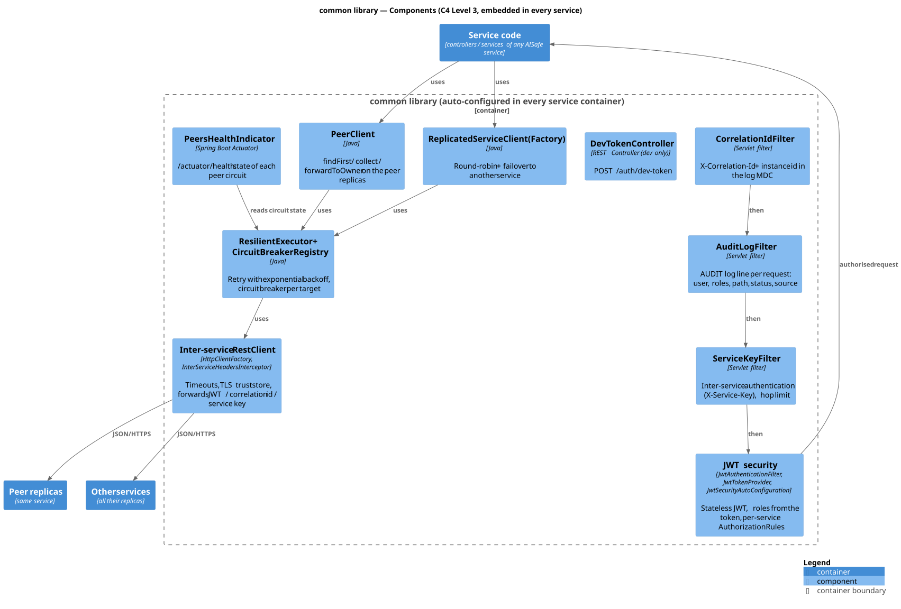

# C4 Level 3 — common library: Components

> The `common` library is **not a container**: it is embedded in every service container and auto-configured by Spring Boot (`META-INF/spring/...AutoConfiguration.imports`). It gives every service the same security, peer forwarding and resilience behaviour ([L2 §3](../../2-containers/Containers.md#3-distribution-design-decisions)).
> Lower level: [L4 Code](../../4-code/common/Common-Code.md)

## Components

| Component | Classes | Responsibility | How a service uses it |
|---|---|---|---|
| **CorrelationIdFilter** | `observability.CorrelationIdFilter` | Assigns/propagates `X-Correlation-Id`; puts it and the instance id in the log MDC | automatic |
| **AuditLogFilter** | `observability.AuditLogFilter` | One `AUDIT` log line per request (user, roles, method, path, status, source, duration) | automatic |
| **ServiceKeyFilter** | `security.ServiceKeyFilter` | Inter-service authentication with `X-Service-Key`; rejects peer requests without key and `X-Peer-Hops > 1` | set `aisafe.security.service-key` |
| **JWT security** | `security.JwtAuthenticationFilter`, `JwtTokenProvider`, `JwtSecurityAutoConfiguration`, `AuthorizationRules` | Stateless JWT authentication; security filter chain; per-service access rules | implement a `<Service>AuthorizationRules` bean |
| **DevTokenController** | `security.DevTokenController` | `POST /auth/dev-token` for tests (dev only) | `aisafe.security.dev-token.enabled=true` |
| **PeerClient** | `peers.PeerClient`, `PeerResult` | `findFirst`, `collect`/`collectList`, `forwardToOwner` on the replicas of the same service | inject `PeerClient`; set `aisafe.peers.urls` |
| **ReplicatedServiceClient** | `remote.ReplicatedServiceClient(Factory)`, `RemoteServiceUnavailableException` | Round-robin + failover over the replicas of another service; `503` if none answers | `factory.create("Airports", urls)` |
| **ResilientExecutor** | `resilience.ResilientExecutor`, `CircuitBreaker`, `CircuitBreakerRegistry` | Retry with exponential backoff; circuit breaker per target | used by the two clients above |
| **Inter-service RestClient** | `http.HttpClientFactory`, `InterServiceHeadersInterceptor`, `OutboundHeaders`, `AisafeHeaders` | Timeouts, TLS truststore, propagation of JWT / correlation id / service key | bean `interServiceRestClient` |
| **PeersHealthIndicator** | `peers.PeersHealthIndicator` | `peers` component of `/actuator/health` with the circuit state of each target | automatic |
| **Configuration** | `config.AisafeProperties` | All `aisafe.*` properties (peers, timeouts, retry, circuit breaker, security, TLS) | `application*.properties` |

## Request pipeline (order of the filters)

`CorrelationIdFilter` → `AuditLogFilter` → `ServiceKeyFilter` → `JwtAuthenticationFilter` → authorization rules → controller.

## Usage examples

See the root [README](../../../README.md#4-using-the-common-library-in-your-service) for code snippets (calling another service, answering with the data of all replicas, forwarding commands to the owner).
