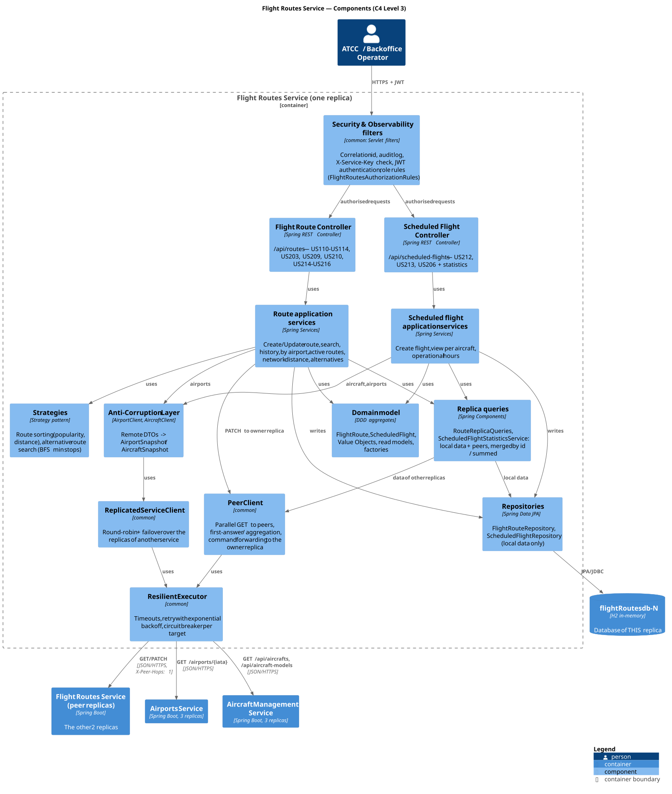

# C4 Level 3 — Flight Routes Service: Components

> Zoom into the **Flight Routes Service** container of [Level 2](../../2-containers/Containers.md): its major building blocks and how they collaborate. One replica is shown; the three replicas are identical.
> Lower levels: [L4 Code](../../4-code/flightroutes/FlightRoutes-Code.md) · [+1 Scenarios](../../5-scenarios/flightroutes/FlightRoutes-Scenarios.md)

## 1. Container summary

| Property | Value |
|---|---|
| Bounded context | Flight Operations — owns `FlightRoute` and `ScheduledFlight` |
| Replicas | `flightroutes-1` :8084, `flightroutes-2` :8184, `flightroutes-3` :8284 |
| Database | H2 in-memory per replica: `flightRoutesdb-1/2/3` |
| Source code | [code/flightroutes](../../../code/flightroutes) |
| API | `http://localhost:8084/swagger-ui.html` (any replica) |

## 2. Components

| Component | Technology / classes | Responsibility |
|---|---|---|
| **Security & Observability filters** | `common` filters + [`FlightRoutesAuthorizationRules`](../../../code/flightroutes/src/main/java/isep/psoft/aisafe/infrastructure/security/FlightRoutesAuthorizationRules.java) | Correlation id, audit log, `X-Service-Key` check, JWT authentication, role rules per endpoint |
| **Flight Route Controller** | [`FlightRouteController`](../../../code/flightroutes/src/main/java/isep/psoft/aisafe/flightroutes/controllers/FlightRouteController.java) (Spring REST) | `/api/routes` — US110–US114, US203, US209, US210, US214–US216 |
| **Scheduled Flight Controller** | [`ScheduledFlightController`](../../../code/flightroutes/src/main/java/isep/psoft/aisafe/flightroutes/controllers/ScheduledFlightController.java) (Spring REST) | `/api/scheduled-flights` — US212, US213, US206 and statistics used for aggregation |
| **Route application services** | `CreateFlightRouteService`, `UpdateFlightRouteService`, `SearchFlightRoutesService`, `GetRouteHistoryService`, `ViewRoutesByAirportService`, `CountRoutesByAirportService`, `ListActiveRoutesService`, `CalculateNetworkDistanceService`, `SearchAlternativeRoutesService` | One service per use case; transactions; orchestration |
| **Scheduled flight application services** | `CreateScheduledFlightService`, `ViewScheduledFlightsByAircraftService`, `CalculateOperationalHoursService` | Business rules of scheduling, flights per aircraft, operational hours |
| **Replica queries** | [`RouteReplicaQueries`](../../../code/flightroutes/src/main/java/isep/psoft/aisafe/flightroutes/services/RouteReplicaQueries.java), `ScheduledFlightStatisticsService`, `Pages` | Combine local data with the data of the peer replicas: merge by id, sum statistics, paginate after merging |
| **Strategies** | `RouteSortStrategy` (`PopularitySortStrategy`, `DistanceSortStrategy`), `RouteSearchStrategy` (`MinStopsRouteSearch`) | Interchangeable sorting (US214) and alternative-route algorithm (US216) |
| **Domain model** | `domain` + `factories` packages | Aggregates `FlightRoute` and `ScheduledFlight`, Value Objects, read models (`RouteSummary`, `Itinerary`, `RouteUsage`) — see [L4](../../4-code/flightroutes/FlightRoutes-Code.md) |
| **Repositories** | `FlightRouteRepository`, `ScheduledFlightRepository` (Spring Data JPA) | Access to the data of **this** replica only |
| **Anti-Corruption Layer** | `AirportClient`, `AircraftClient` → `AirportSnapshot`, `AircraftSnapshot`; `RestClientConfig` | Translate the Airports / Aircraft Management APIs into local read-only views |
| **PeerClient** *(common)* | [`PeerClient`](../../../code/common/src/main/java/isep/sidis/common/peers/PeerClient.java) | GET to the peer replicas (first answer / aggregation) and command forwarding to the owner replica |
| **ReplicatedServiceClient** *(common)* | `ReplicatedServiceClient` | Round-robin + failover over the replicas of Airports / Aircraft Management |
| **ResilientExecutor** *(common)* | `ResilientExecutor`, `CircuitBreaker` | Timeouts, retry with exponential backoff, circuit breaker per target |
| *Demo data* | `DemoDataBootstrap` (profile `demo`) | Loads a different set of routes/flights in each replica |

The `common` components are described in [common — Components](../common/Common-Components.md).

## 3. Provided interfaces (REST API)

Every endpoint is served by every replica; **every GET returns the data of all replicas**.

**Flight routes — `/api/routes`**

| Method | Endpoint | US | Input | Output | Roles |
|---|---|---|---|---|---|
| POST | `/api/routes` | US110 | `CreateRouteDTO` (originIATA, destIATA, estimatedFlightTime, minRange, minCapacity) | `201` `FlightRouteDTO` | ATCC |
| GET | `/api/routes/{id}` | US113 | route ID | `200` `FlightRouteDTO` | ATCC |
| GET | `/api/routes/search?origin=&dest=` | US114 | optional IATA codes | `200` `List<FlightRouteDTO>` | ATCC |
| PATCH | `/api/routes/{id}` | US112 | `UpdateRouteDTO` (any of minRange, minCapacity, estimatedFlightTime, status) | `200` `FlightRouteDTO` | ATCC, BACKOFFICE_OPERATOR |
| GET | `/api/routes/{id}/history` | US111 | route ID | `200` `List<RouteHistoryDTO>` | ATCC |
| GET | `/api/routes/by-airport/{iataCode}` | US209 | IATA code | `200` `List<FlightRouteDTO>` | ATCC |
| GET | `/api/routes/active?sortBy=` | US214 | `popularity` (default) / `distance` | `200` `List<FlightRouteDTO>` with `usageCount` | ATCC |
| GET | `/api/routes/network/total-distance` | US215 | — | `200` `NetworkDistanceDTO` | ATCC |
| GET | `/api/routes/alternatives?origin=&dest=` | US216 | IATA codes | `200` `List<ItineraryDTO>` | ATCC |
| GET | `/api/routes/compatible?range=&capacity=` | US203 | aircraft range and capacity | `200` `List<FlightRouteDTO>` | ATCC, MAINTENANCE_SUPERVISOR, MAINTENANCE_TECHNICIAN |
| GET | `/api/routes/statistics/count-by-airport` | US210 | — | `200` `Map<IATA, Long>` | BACKOFFICE_OPERATOR |

**Scheduled flights — `/api/scheduled-flights`**

| Method | Endpoint | US | Input | Output | Roles |
|---|---|---|---|---|---|
| POST | `/api/scheduled-flights` | US212 | `CreateScheduledFlightDTO` (aircraftRegistration, routeID, date, time) | `201` `ScheduledFlightDTO` + links | ATCC |
| GET | `/api/scheduled-flights/{id}` | — | flight ID | `200` `ScheduledFlightDTO` | ATCC |
| GET | `/api/scheduled-flights?aircraft=&page=&size=` | US213 | registration + pagination | `200` `PagedModel<ScheduledFlightDTO>` | ATCC |
| GET | `/api/scheduled-flights/search?aircraft=&date=&time=` | US213/US212 | registration, optional date/time | `200` `List<ScheduledFlightDTO>` | ATCC |
| GET | `/api/scheduled-flights/operational-hours` | US206 | pagination | `200` `Page<AircraftOperationalHoursDTO>` | ATCC |
| GET | `/api/scheduled-flights/statistics/usage-by-route` | US214 | — | `200` `Map<routeId, Long>` | ATCC |
| GET | `/api/scheduled-flights/statistics/minutes-by-aircraft` | US206 | — | `200` `Map<registration, Long>` | ATCC |

Infrastructure endpoints (from `common`): `GET /actuator/health`, `POST /auth/dev-token` (development only), `/swagger-ui.html`.

**Errors** — body `{ "error": "<message>" }` (Bean Validation: `{ "<field>": "<message>" }`):

| Exception | HTTP |
|---|---|
| `IllegalArgumentException`, `MethodArgumentNotValidException` | 400 |
| `EntityNotFoundException` | 404 |
| `IllegalStateException`, `ObjectOptimisticLockingFailureException` | 409 |
| `RouteRequirementsNotMetException` | 422 |
| `RemoteServiceUnavailableException` (no replica of a remote service answered) | 503 |
| `ResponseStatusException` (remote 401/403, business error of the owner replica) | same status |

## 4. Required interfaces

| Component | Calls | Endpoint |
|---|---|---|
| `AirportClient` | Airports (all replicas) | `GET /airports/{iata}` |
| `AircraftClient` | Aircraft Management (all replicas) | `GET /api/aircrafts/{reg}`, `GET /api/aircraft-models/{model}` |
| `PeerClient` | Flight Routes peer replicas | the same endpoint as the incoming request, `X-Peer-Hops: 1` |

## 5. How the components realise the distribution requirements

| Requirement | Components involved |
|---|---|
| Peer forwarding of GET by id (US113, US111, flight by id) | Route/flight services → `RouteReplicaQueries.findById` / `PeerClient.findFirst` |
| Aggregation of collections (US114, US203, US209, US213) | services → `RouteReplicaQueries.withPeers` / `PeerClient.collectList`, merged by id |
| Aggregated statistics (US206, US210, US214) | `ScheduledFlightStatisticsService`, `CountRoutesByAirportService` → `PeerClient.collect`, summed |
| Whole-network queries (US214, US215, US216) | `RouteReplicaQueries.activeNetwork` → strategies |
| Single owner per route (US112) | `UpdateFlightRouteService` → `PeerClient.forwardToOwner` |
| Calls to other services with failover | ACL → `ReplicatedServiceClient` → `ResilientExecutor` |
| Security and audit | filter chain of `common` + `FlightRoutesAuthorizationRules` |

The system-wide decisions (consistency model, fault tolerance, security) are in [L2 §3](../../2-containers/Containers.md#3-distribution-design-decisions).
