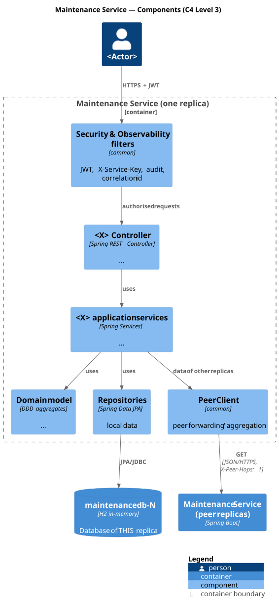

# C4 Level 3 — Maintenance Service: Components

> Zoom into the **Maintenance Service** container of [Level 2](../../2-containers/Containers.md). Template — follow [Flight Routes — Components](../flightroutes/FlightRoutes-Components.md).
> Lower levels: [L4 Code](../../4-code/maintenance/Maintenance-Code.md) · [+1 Scenarios](../../5-scenarios/maintenance/Maintenance-Scenarios.md)

## 1. Container summary

| Property | Value |
|---|---|
| Bounded context | |
| Replicas | `maintenance-1` :8082, `maintenance-2` :8182, `maintenance-3` :8282 |
| Database | H2 in-memory per replica: `maintenancedb-1/2/3` |
| Source code | [code/maintenance](../../../code/maintenance) |
| API | `http://localhost:8082/swagger-ui.html` |

## 2. Components

| Component | Technology / classes | Responsibility |
|---|---|---|
| Security & Observability filters | `common` + `MaintenanceAuthorizationRules` | |
| Controllers | Spring REST Controllers | |
| Application services | Spring Services | |
| Replica queries | uses `PeerClient` | local data + peers |
| Domain model | aggregates | |
| Repositories | Spring Data JPA | local data |
| Anti-Corruption Layer | clients of other services (`ReplicatedServiceClient`) | |

## 3. Provided interfaces (REST API)

| Method | Endpoint | US | Input | Output | Roles |
|---|---|---|---|---|---|
| | | | | | |

## 4. Required interfaces

| Component | Calls | Endpoint |
|---|---|---|
| | | |

## 5. How the components realise the distribution requirements

| Requirement | Components involved |
|---|---|
| Peer forwarding of GET by id | |
| Aggregation of collections / statistics | |
| Single owner per record (updates) | |
| Calls to other services with failover | |
