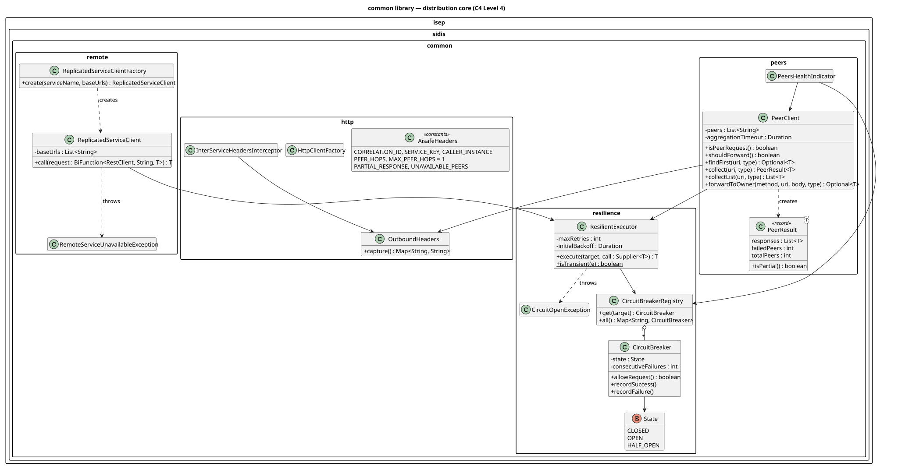

# C4 Level 4 — common library: Code

> Classes behind the [common components](../../3-components/common/Common-Components.md). Source: [code/common/src/main/java/isep/sidis/common](../../../code/common/src/main/java/isep/sidis/common)

## Key classes

| Class | Key behaviour |
|---|---|
| [`PeerClient`](../../../code/common/src/main/java/isep/sidis/common/peers/PeerClient.java) | `shouldForward()` is false when there are no peers or the current request has `X-Peer-Hops`. `findFirst` sends the GET to all peers on virtual threads and completes with the first `200` (404 = "not mine"). `collect` waits for every peer (bounded by `aggregation-timeout`) and counts failures. `forwardToOwner` tries the peers one by one until one accepts the command; a 4xx from the owner becomes a `ResponseStatusException` with the same status. On any failed peer it sets `X-Partial-Response` / `X-Unavailable-Peers`. Copies the MDC (correlation id) to the worker threads. |
| [`ResilientExecutor`](../../../code/common/src/main/java/isep/sidis/common/resilience/ResilientExecutor.java) | `execute(target, call)`: fails fast with `CircuitOpenException` when the circuit is open; retries transient failures (`ResourceAccessException`, `HttpServerErrorException`) with exponential backoff; a 4xx counts as success for the breaker and is not retried. |
| [`CircuitBreaker`](../../../code/common/src/main/java/isep/sidis/common/resilience/CircuitBreaker.java) | CLOSED → OPEN after `failureThreshold` consecutive failures; OPEN → HALF_OPEN after `openDuration`; HALF_OPEN → CLOSED on success, → OPEN on failure. Thread-safe, clock injected for tests. |
| [`ReplicatedServiceClient`](../../../code/common/src/main/java/isep/sidis/common/remote/ReplicatedServiceClient.java) | `call((restClient, baseUrl) -> ...)`: round-robin start replica, failover to the next on transient failure, `RemoteServiceUnavailableException` when all fail. |
| [`ServiceKeyFilter`](../../../code/common/src/main/java/isep/sidis/common/security/ServiceKeyFilter.java) | Peer requests must carry a valid key (`401`); hop count must be 1 (`400`); constant-time comparison. |
| [`OutboundHeaders`](../../../code/common/src/main/java/isep/sidis/common/http/OutboundHeaders.java) | Captures `Authorization`, correlation id, service key and caller instance from the current request. |
| [`JwtSecurityAutoConfiguration`](../../../code/common/src/main/java/isep/sidis/common/security/JwtSecurityAutoConfiguration.java) | Security filter chain; public `/actuator/health`, `/swagger-ui/**`, `/auth/dev-token`; applies every `AuthorizationRules` bean. |
| [`DistributedInfrastructureAutoConfiguration`](../../../code/common/src/main/java/isep/sidis/common/DistributedInfrastructureAutoConfiguration.java) | Creates the beans: registry, executor, RestClient, `PeerClient`, factory, correlation filter, health indicator. |
| [`AisafeProperties`](../../../code/common/src/main/java/isep/sidis/common/config/AisafeProperties.java) | All `aisafe.*` settings with defaults. |

## Patterns

Circuit Breaker, Retry with Exponential Backoff, Timeout, Scatter-Gather (aggregation), Load Balancer (client-side round-robin), Chain of Responsibility (servlet filters), Auto-configuration / Dependency Injection.

## Tests

`CircuitBreakerTest`, `ResilientExecutorTest` and `PeerClientTest` (against fake HTTP replicas) — see [Flight Routes scenarios §5](../../5-scenarios/flightroutes/FlightRoutes-Scenarios.md#5-tests).
