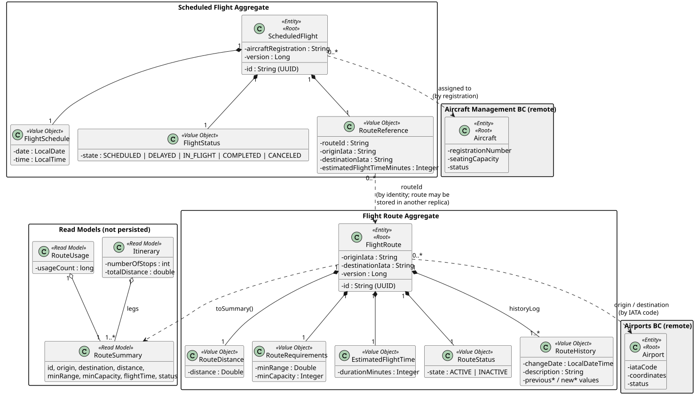
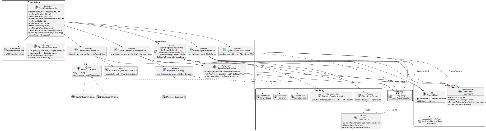
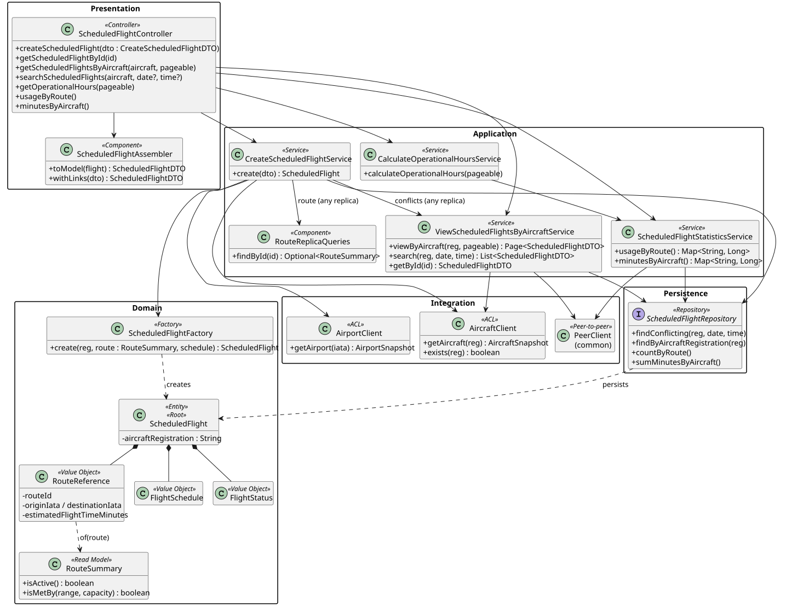

# C4 Level 4 — Flight Routes Service: Code

> Zoom into the components of [L3](../../3-components/flightroutes/FlightRoutes-Components.md): the significant classes, their relationships and the design patterns. Class names link to the source code.
> Source root: [code/flightroutes/src/main/java/isep/psoft/aisafe](../../../code/flightroutes/src/main/java/isep/psoft/aisafe)

## 1. Domain model

### Aggregates

| Aggregate | Root | Value Objects | Invariants protected by the root |
|---|---|---|---|
| Flight Route | [`FlightRoute`](../../../code/flightroutes/src/main/java/isep/psoft/aisafe/flightroutes/domain/FlightRoute.java) | `RouteDistance`, `RouteRequirements`, `EstimatedFlightTime`, `RouteStatus`, `RouteHistory` | Required origin/destination; non-negative distance; positive requirements and flight time; valid status transitions; every change recorded in the history |
| Scheduled Flight | [`ScheduledFlight`](../../../code/flightroutes/src/main/java/isep/psoft/aisafe/flightroutes/domain/ScheduledFlight.java) | [`RouteReference`](../../../code/flightroutes/src/main/java/isep/psoft/aisafe/flightroutes/domain/RouteReference.java), `FlightSchedule`, `FlightStatus` | Required aircraft, route, date and time; created as `SCHEDULED` |

- `FlightRoute` has no setters: its state only changes through `updateDetails` and `changeStatus`, which guarantees a complete history (US111). Value Objects are immutable and self-validating; on update they are **replaced**.
- Both roots have `@Version` (optimistic locking): concurrent updates of a route, or concurrent bookings in the same replica, fail with `409`.
- **`ScheduledFlight` → `FlightRoute` by identity.** The route may be stored in another replica, so a JPA association (foreign key/JOIN) is impossible. `RouteReference` keeps the `routeId` and a snapshot of the data the flight needs (origin, destination, flight time); the snapshot also preserves the flight as scheduled if the route changes later.
- **Read models** (not persisted, no identity): [`RouteSummary`](../../../code/flightroutes/src/main/java/isep/psoft/aisafe/flightroutes/domain/RouteSummary.java) — a replica-independent view of a route, created from local routes (`FlightRoute.toSummary()`) and from routes received from peers (`FlightRouteDTO`); `Itinerary` (US216); `RouteUsage` (US214).
- Other aggregates are referenced by identity only: `FlightRoute` → Airport (IATA code), `ScheduledFlight` → Aircraft (registration).

## 2. Class diagrams

**Flight routes (US110–US114, US209, US203, US210, US214–US216)**

**Scheduled flights (US212, US213, US206)**

## 3. Design rationale (responsibility assignment)

**Create route (US110)**

| Question: which class is responsible for... | Answer | Justification (patterns) |
|---|---|---|
| ...receiving the HTTP request? | `FlightRouteController` | **Controller (REST)** |
| ...coordinating the use case and the transaction? | `CreateFlightRouteService` | **Application Service** |
| ...checking for a duplicate route? | `FlightRouteRepository` + `PeerClient` | **Repository** (local) + peer query (other replicas) |
| ...obtaining the airports' coordinates? | `AirportClient` | **Anti-Corruption Layer / Indirection** |
| ...calculating the distance? | `DistanceCalculatorService` | **Domain Service** (Haversine) |
| ...building a valid aggregate? | `FlightRouteFactory` | **Factory / Creator** |
| ...recording the creation in the history? | `FlightRoute` | **Information Expert / Aggregate Root** |
| ...persisting it? | `FlightRouteRepository` | **Repository** — stored in the replica that received the request |
| ...building the response? | `FlightRouteAssembler` | **DTO / Assembler** |

**Update or deactivate route (US112, US111)**

| Question | Answer | Justification |
|---|---|---|
| ...loading the route? | `FlightRouteRepository` | **Repository** |
| ...sending the command to the replica that stores the route? | `PeerClient.forwardToOwner` | **Indirection** — a route has a single owner |
| ...applying the partial update, recording only changed values? | `FlightRoute.updateDetails` | **Information Expert / Aggregate Root** |
| ...validating the status transition? | `FlightRoute.changeStatus` | **Information Expert** |
| ...detecting concurrent updates? | `@Version` | **Optimistic Locking** |

**Create scheduled flight (US212)**

| Question | Answer | Justification |
|---|---|---|
| ...coordinating validations and creation? | `CreateScheduledFlightService` | **Application Service** |
| ...obtaining aircraft status, capacity and range? | `AircraftClient` → `AircraftSnapshot` | **ACL** — two remote resources (aircraft + model) in one local view |
| ...finding the route in any replica? | `RouteReplicaQueries.findById` | **Pure Fabrication** |
| ...knowing whether the route is active and its requirements are met? | `RouteSummary.isActive`, `RouteSummary.isMetBy` → `RouteRequirements.isMetBy` | **Information Expert** |
| ...knowing whether the aircraft is available / airports operational? | `AircraftSnapshot.isAvailable`, `AirportSnapshot.isOperational` | **Information Expert** |
| ...checking overlapping flights in every replica? | `ViewScheduledFlightsByAircraftService.search` | Repository + peer query |
| ...instantiating the flight and its route reference? | `ScheduledFlightFactory`, `RouteReference.of` | **Factory / Creator** |
| ...adding HATEOAS links (also to flights received from peers)? | `ScheduledFlightAssembler` | **Assembler** (`RepresentationModelAssembler`) |

**Network queries (US214, US215, US216)**

| Question | Answer | Justification |
|---|---|---|
| ...obtaining the active routes of every replica? | `RouteReplicaQueries.activeNetwork` | **Pure Fabrication** — local + peers, merged by id |
| ...computing popularity across replicas? | `ScheduledFlightStatisticsService.usageByRoute` | Counts per `routeId` in each replica, summed |
| ...sorting by the selected criterion? | `RouteSortStrategy` (`PopularitySortStrategy`, `DistanceSortStrategy`) | **Strategy / Protected Variation** — new criterion = new bean |
| ...finding alternative itineraries? | `RouteSearchStrategy` (`MinStopsRouteSearch`, BFS) | **Strategy** (Forum conversation 013) |
| ...summing the network distance? | `CalculateNetworkDistanceService` | Sum over the merged network |

## 4. Package organization

| Package | Layer / L3 component | DDD role |
|---|---|---|
| `flightroutes.controllers`, `dto`, `assemblers` | Controllers | Published Language (API contract separate from the domain) |
| `flightroutes.services`, `services.strategy` | Application services, Replica queries, Strategies | Application Services + Domain Service |
| `flightroutes.domain`, `factories` | Domain model | Entities, Value Objects, Aggregates, Read Models, Factories |
| `flightroutes.repositories` | Repositories | One repository per Aggregate Root (local data) |
| `flightroutes.clients` | Anti-Corruption Layer | ACL |
| `flightroutes.bootstrap` | Demo data | profile `demo` |
| `infrastructure`, `exceptions` | Security & config | Security rules, OpenAPI, error mapping |

## 5. Implementation notes

- **Remote access:** `RestClientConfig` creates one `ReplicatedServiceClient` per remote service with all its replicas. Clients map responses: `404` → `EntityNotFoundException`, `401/403` → `ResponseStatusException`, no replica available → `RemoteServiceUnavailableException` (`503`).
- **Services never decide whether to forward:** `PeerClient` does nothing when the current request already came from a peer, so the same service code answers clients (all replicas) and peers (local only).
- **Partial update:** all `UpdateRouteDTO` fields are optional; `updateDetails` ignores `null`/unchanged values and records nothing if nothing changes.
- **History:** `RouteHistory` is an `@ElementCollection` (`ROUTE_HISTORY_LOG`) with factory methods `created`, `detailsUpdated`, `statusChanged`; `RouteHistoryDTO` uses `@JsonInclude(NON_NULL)`.
- **Statistics without JOINs:** `ScheduledFlightRepository.countByRoute` / `sumMinutesByAircraft` group local flights (flight time from `RouteReference`); `ScheduledFlightStatisticsService` sums all replicas.
- **Tolerant reader:** DTOs exchanged between replicas use `@JsonIgnoreProperties(ignoreUnknown = true)`; HATEOAS links of flights received from peers are rebuilt to point to the entry replica (`ScheduledFlightAssembler.withLinks`).
- **Pagination after merging:** `Pages.of` cuts the page after merging and sorting the data of all replicas.

## 6. Configuration files

| File | Content |
|---|---|
| [`application.properties`](../../../code/flightroutes/src/main/resources/application.properties) | Defaults (= replica 1), remote URLs, resilience, security, logging, actuator |
| `application-instance1/2/3.properties` | Port, instance id, database, peers and demo data of each replica |
| `application-demo.properties` / `application-tls.properties` | Demo data / HTTPS |

## 7. Code-level observations

- `FlightStatus` transitions remain future work (conversation 006).
- No caching of aggregated results; the circuit breaker avoids waiting for replicas known to be down.
- Static peer list: adding a replica requires updating the others' configuration.
