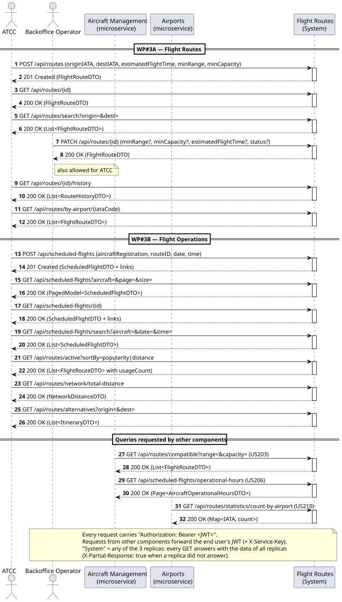
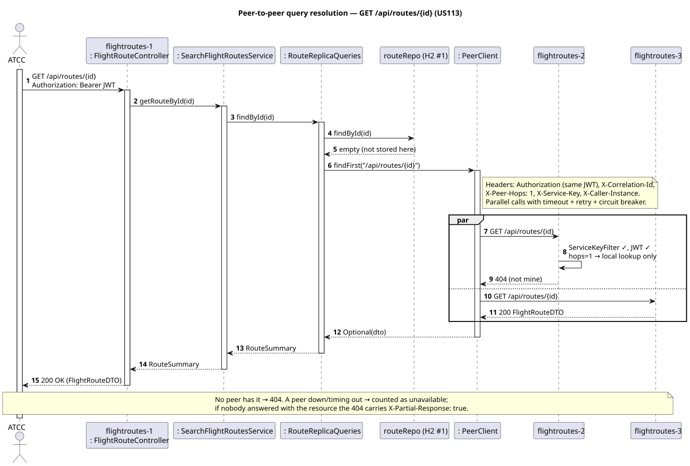
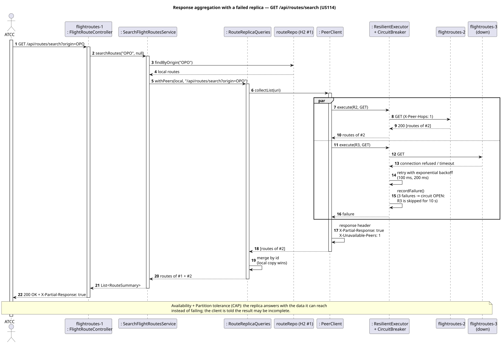
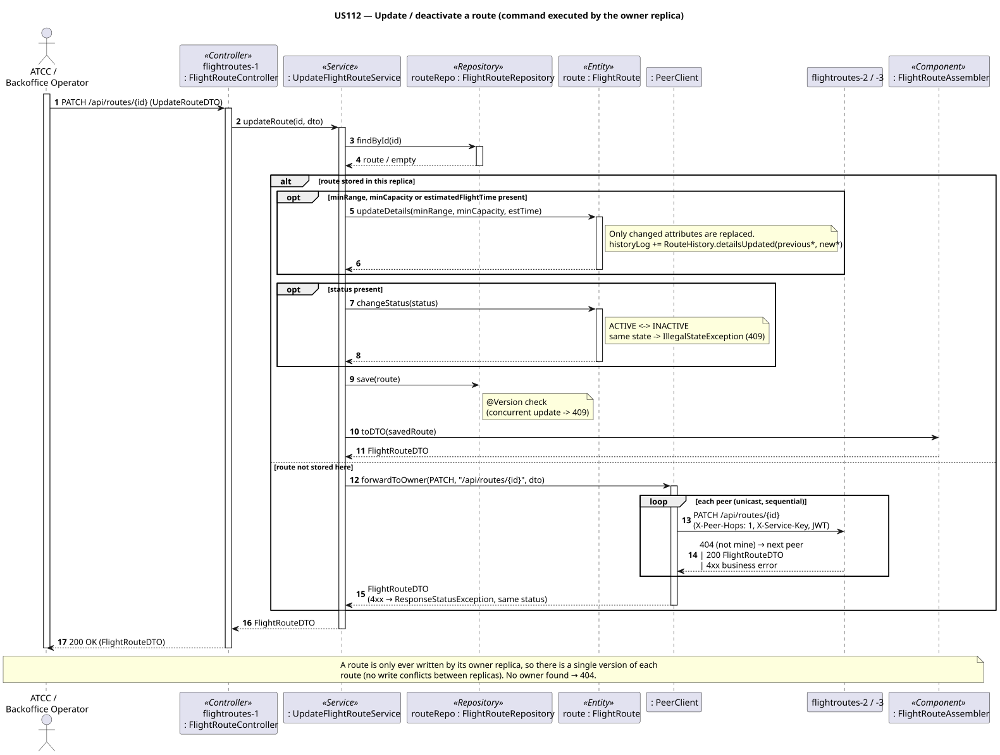
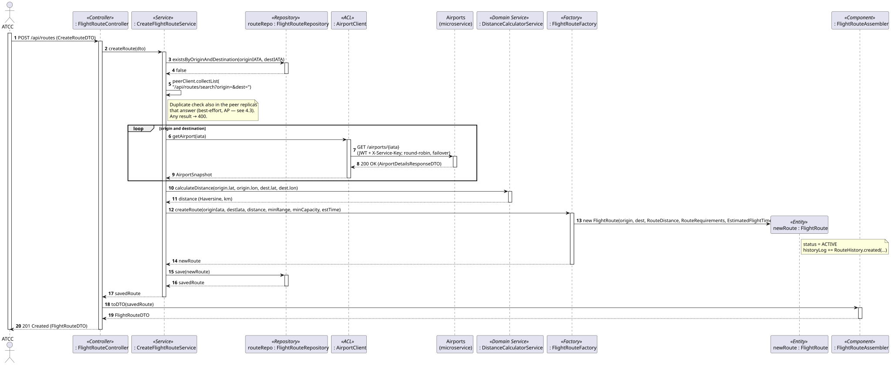
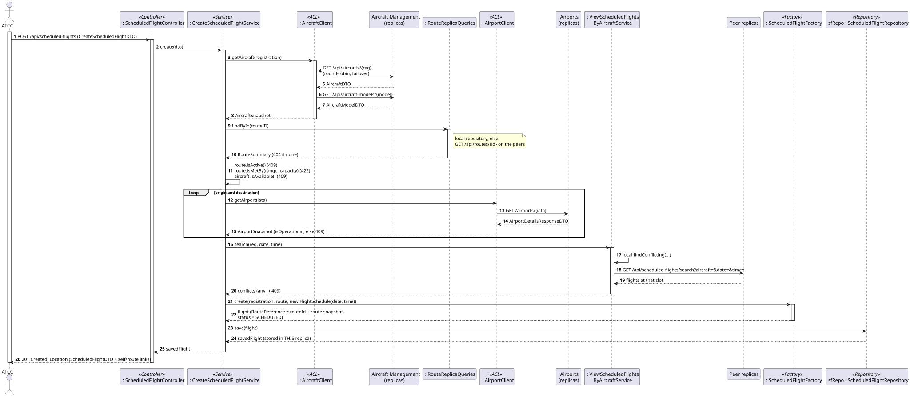
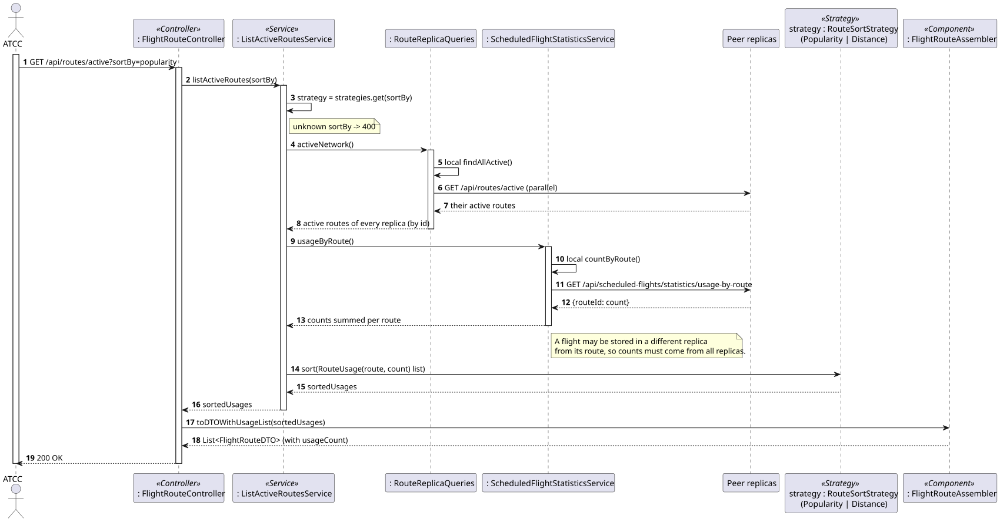
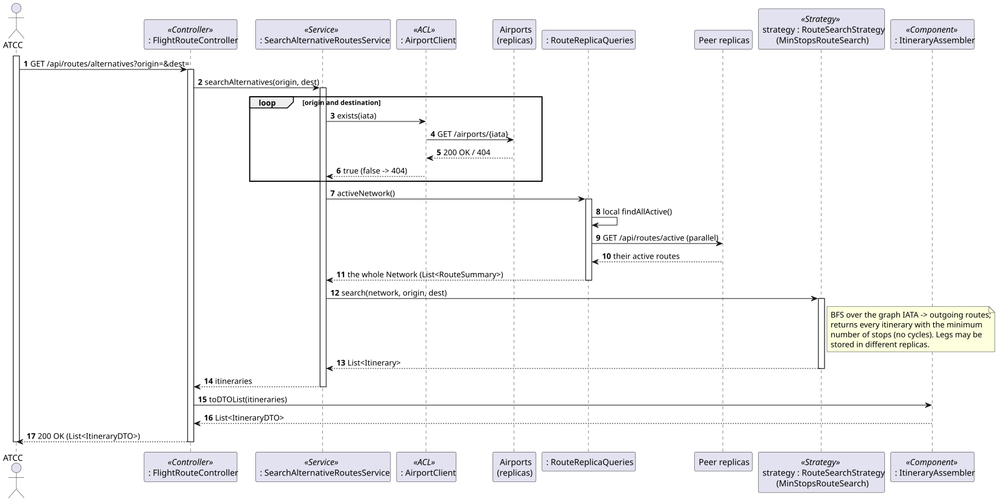

# C4+1 — Flight Routes Service: Scenarios

> The "+1" view: real use cases and end-to-end behaviour across containers and components. Each scenario validates [L2](../../2-containers/Containers.md), [L3](../../3-components/flightroutes/FlightRoutes-Components.md) and [L4](../../4-code/flightroutes/FlightRoutes-Code.md).

## 1. User stories

| WP | US | Description | Actor |
|---|---|---|---|
| 3A | US110 | Create a flight route between two registered airports | ATCC |
| 3A | US111 | View the change history of a route | ATCC |
| 3A | US112 | Update the operational details of a route or deactivate it | ATCC, Backoffice Operator |
| 3A | US113 | View the details of a route given its ID | ATCC |
| 3A | US114 | Search routes by origin and/or destination | ATCC |
| 2B | US209 | View all routes that depart from or arrive at a specific airport | ATCC |
| 3B | US212 | Assign an aircraft to a route for a date/time (create a scheduled flight) | ATCC |
| 3B | US213 | View all scheduled flights of a specific aircraft | ATCC |
| 3B | US214 | List active routes sorted by popularity or distance | ATCC |
| 3B | US215 | Calculate the total distance of the network | ATCC |
| 3B | US216 | Search for alternative routes between two airports | ATCC |

Supplied to other containers: **US203** compatible routes and **US206** operational hours (Aircraft Management), **US210** routes per airport (Airports).

### Clarifications

- **Conv. 002:** routes exist independently of an airport's state, but scheduled flights can be affected; the distance is fixed at creation.
- **Conv. 006:** flight lifecycle `SCHEDULED`, `DELAYED`, `IN_FLIGHT`, `COMPLETED`, `CANCELED`; transitions are future work.
- **Conv. 007:** the Route ID is system generated. **Conv. 010:** the *Network* is the set of active routes. **Conv. 012:** routes are point-to-point. **Conv. 013:** alternative routes chain existing routes; the algorithm must be replaceable (one is enough).

## 2. Acceptance criteria

**Flight routes:** AC1 airports must exist (else `400`); AC2 one route per origin/destination in every replica that answers (else `400`); AC3 distance by Haversine, never changes; AC4 `minRange`, `minCapacity`, `estimatedFlightTime` positive; AC5 created `ACTIVE`, changing to the current state → `409`; AC6 history records only the changed attributes; AC7 concurrent updates → `409`.

**Scheduled flights:** AC8 aircraft and route (any replica) must exist (else `404`); AC9 range/capacity must meet the requirements (else `422`); AC10 route `ACTIVE`, aircraft `AVAILABLE`, airports `OPERATIONAL`, no other flight of the aircraft at that date/time in any replica that answers (else `409`); AC11 `201` + `Location` + HATEOAS links; AC12 per-aircraft list paginated after merging the replicas.

**Network:** AC13 US214–US216 use only `ACTIVE` routes of every replica; AC14 sorting and search are strategies; unknown `sortBy` → `400`.

**Distribution:** AC15 any replica answers with the data of all replicas, `404` if no replica has it; AC16 a failed peer gives a `200` with `X-Partial-Response: true`; AC17 a route is only modified by its owner replica; AC18 peer requests without valid `X-Service-Key` → `401`, `X-Peer-Hops > 1` → `400`; AC19 JWT + roles on every endpoint, every request audited; AC20 `503` when no replica of a remote service answers.

## 3. System sequence diagram

"System" = any of the three replicas.

## 4. Scenarios (sequence diagrams)

### 4.1 Distributed scenarios

**S1 — Peer-to-peer query resolution: GET a route stored in another replica (US113; same for US111 and flight by id)**

**S2 — Response aggregation with a failed replica (US114; same for US203, US209, US210, US213)**

**S3 — Update / deactivate a route: command forwarded to the owner replica (US112)**

### 4.2 Use-case scenarios

**S4 — Create route (US110)**

**S5 — Create scheduled flight (US212)**

**S6 — List active routes by popularity (US214)**

**S7 — Search alternative routes (US216)**

## 5. Tests

From `code/`: `./mvnw test` — 43 tests, all passing.

| Test class | Type | What is verified |
|---|---|---|
| `FlightRouteTest` | Unit (domain) | Value Object validation, `ACTIVE` with history, history of changed attributes only, status transitions, `isMetBy`, `toSummary` |
| `ScheduledFlightTest` | Unit (domain) | `SCHEDULED`, reference/snapshot of a route stored in another replica, mandatory data |
| `RouteStrategiesTest` | Unit | BFS with fewest stops (no cycles, unreachable), popularity/distance sorting |
| `PeerClientTest` (common) | Integration with fake HTTP replicas | first answer, nobody has it, headers sent, aggregation with a dead peer, slow peer timeout, no re-forwarding, command forwarding and `409` propagation |
| `CircuitBreakerTest`, `ResilientExecutorTest` (common) | Unit | open/half-open/close; retry, give-up, no retry on 4xx, fail fast |
| **`ReplicaCollaborationTest`** | **Distributed** — two real replicas + stubs of Airports and Aircraft Management | scenarios below |

`ReplicaCollaborationTest` (week 4 scenarios 1–3 and the replica-failure test):

1. Each replica stores the routes it receives; local access `200`.
2. GET on A of a route stored on B → forwarded, `200` (S1).
3. Search on A and on B → same merged list (S2).
4. Duplicate route on A while it exists on B → `400`.
5. PATCH on A of a route of B → executed by B; history via A; owner's `409` propagated (S3).
6. Flight on A for a route on B → `201`; same aircraft/slot on B → `409`; flight read through B (S5).
7. Popularity seen from B counts the flight in A; operational hours and network distance aggregated (S6).
8. Alternative OPO→MAD combines legs stored in B and A (S7).
9. Peer headers without/wrong service key → `401`; hops 2 → `400`; valid peer request → only local data.
10. No token → `401`; wrong role → `403`; health `UP` with `peers`.
11. Replica B stopped: A answers `200` with `X-Partial-Response: true`; local route `200`; route only in B → `404` (S2).

**Postman:** [postman/FlightRoutes.postman_collection.json](postman/FlightRoutes.postman_collection.json) + [environment](postman/FlightRoutes.postman_environment.json), against the three replicas with the `demo` profile — folders: setup, local access, forwarding, aggregation, command forwarding, security, replica failure (stop replica 2 before the last folder). Verified with Newman: 30 requests, 60 assertions, 0 failures.

## 6. Demo

From `code/`:

1. `./mvnw clean install`
2. `./scripts/start-replicas.sh flightroutes demo` (Windows: `.\scripts\start-replicas.ps1 -Service flightroutes -Profiles demo`). Each replica loads different data: replica 1 OPO-LIS, LIS-MAD; replica 2 MAD-CDG, LIS-FNC; replica 3 CDG-LHR, OPO-MAD (+ flights).
3. `GET http://localhost:8084/actuator/health` (also 8184, 8284).
4. `POST http://localhost:8084/auth/dev-token` `{"username":"atcc1","roles":["ATCC"]}` → token for Postman / Swagger *Authorize*.
5. Run the Postman collection, or by hand:
   - `GET :8084/api/routes/search` and `:8184/...` → the same 6 routes.
   - `GET :8084/api/routes/{id of CDG-LHR}` → `200`; log of replica 1: `Not found locally: forwarding GET ...`; replica 3: `AUDIT ... source=peer:flightroutes-1` with the same correlation id.
   - `GET :8184/api/scheduled-flights/operational-hours` → CS-TUA = 240 min (flights in 3 replicas).
   - `PATCH :8084/api/routes/{id of MAD-CDG}` `{"minCapacity":160}` → executed by replica 2.
   - Stop replica 2 → search returns 4 routes with `X-Partial-Response: true`; `/actuator/health` shows `8184` `OPEN`.
   - HTTPS: add the `tls` profile (`demo,tls`) and use `https://`.

H2 console: `http://localhost:8084/h2-console` (JDBC URL `jdbc:h2:mem:flightRoutesdb-1`).

## 7. Observations

- Cross-replica uniqueness is best-effort (AP, see [L2 §3.3](../../2-containers/Containers.md#33-consistency-model-cap)); deterministic ownership (hash → replica) is a possible improvement.
- Shared secrets have development defaults; outside development use `JWT_SECRET`, `AISAFE_SERVICE_KEY`, `AISAFE_TLS_PASSWORD`, `AISAFE_DEV_TOKEN=false`.
- No events/message queues (Assignment 1 allows HTTP/REST commands only): popularity and operational hours are computed on demand from all replicas.
